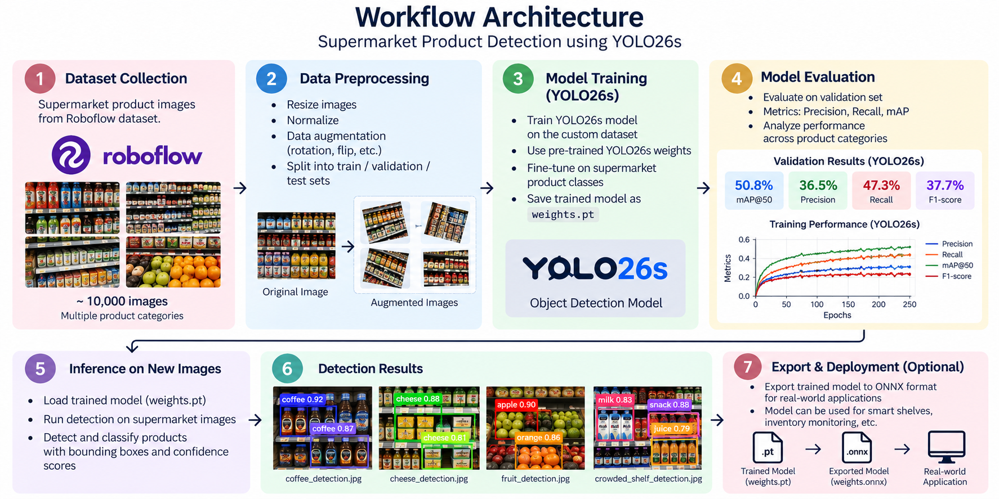
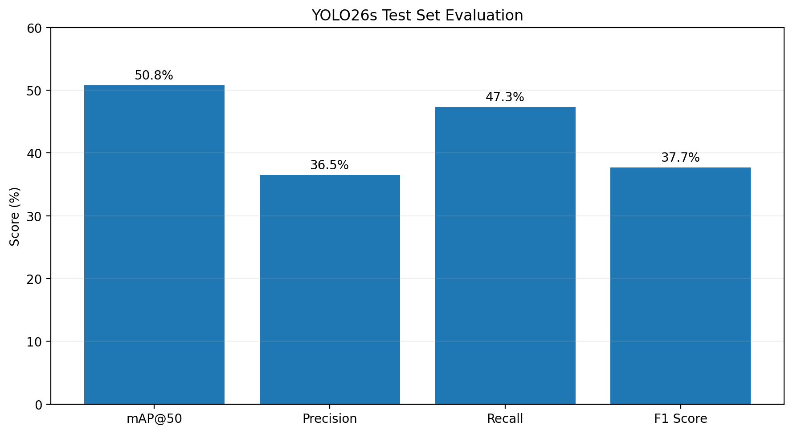
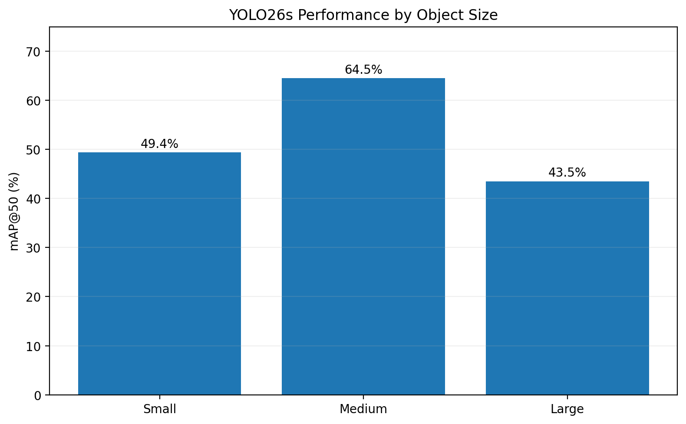
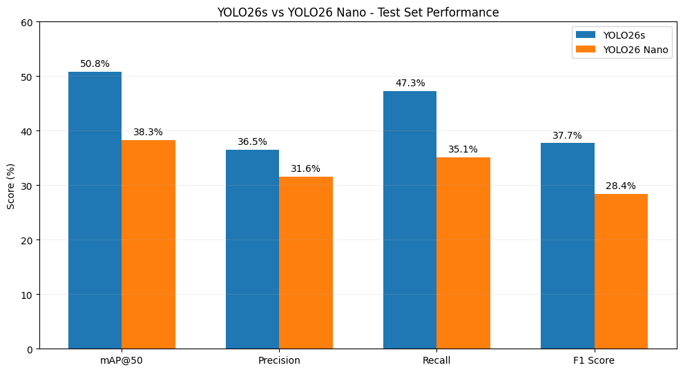
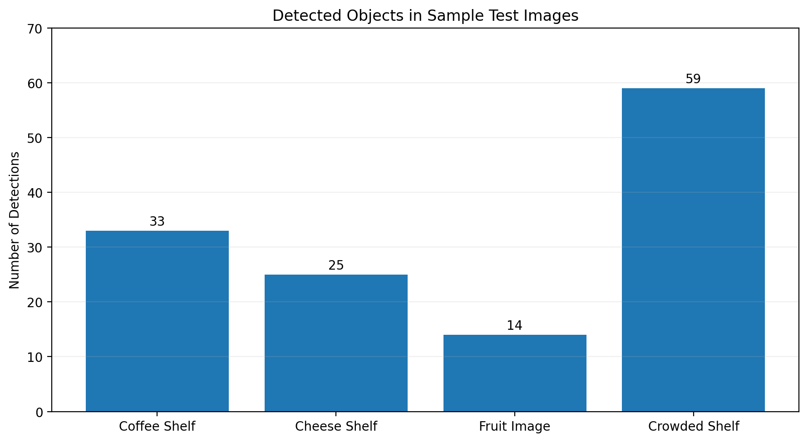
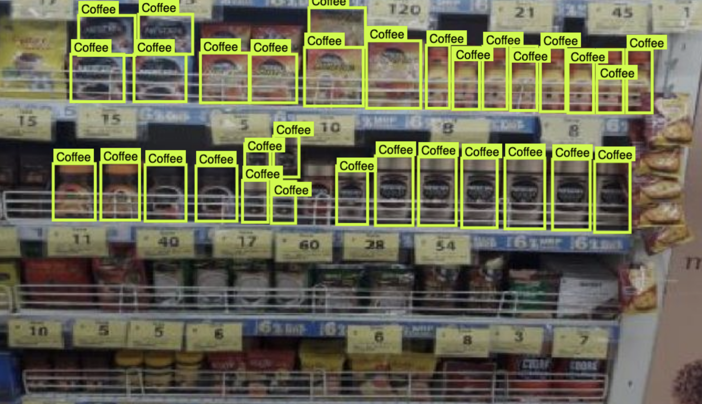
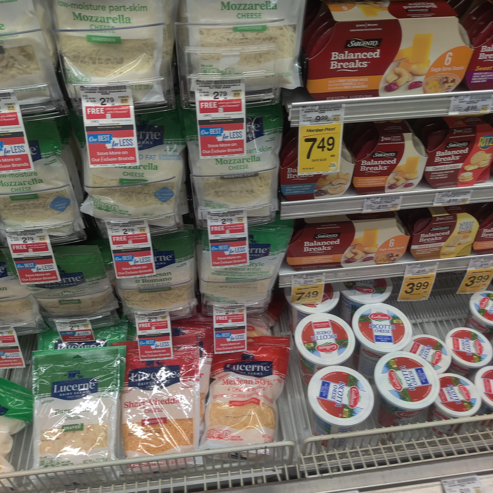
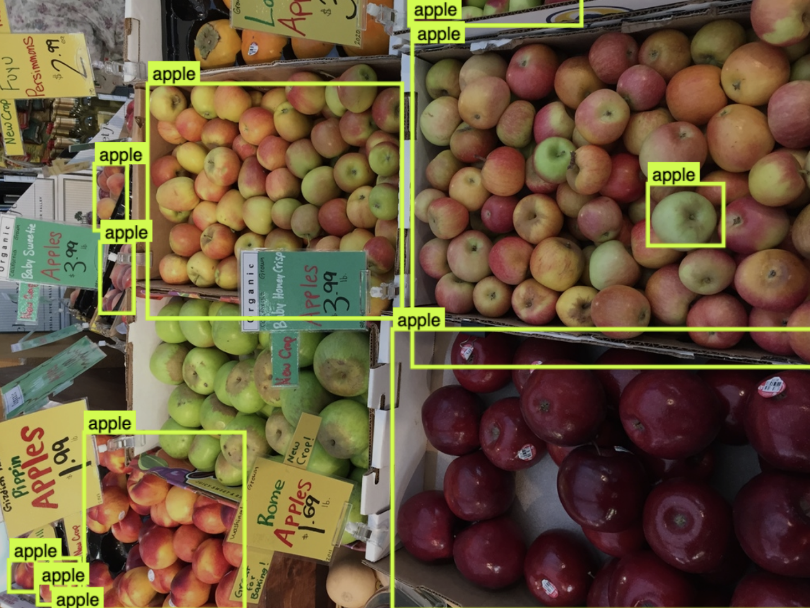
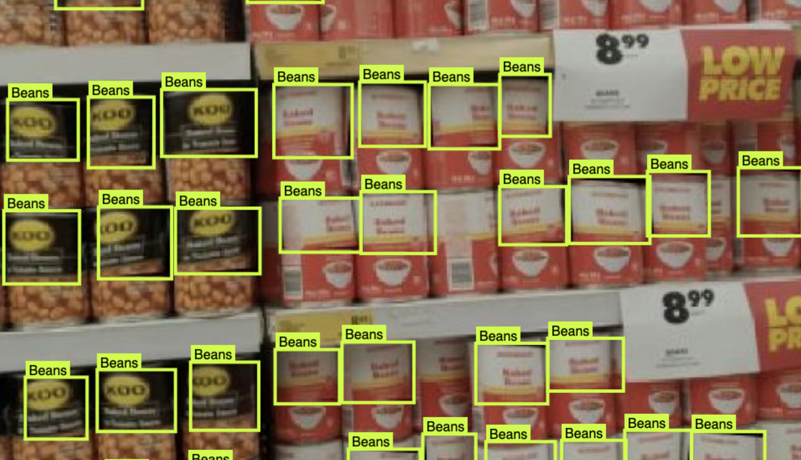

# Supermarket Product Detection using YOLO

## Project Overview

This project develops a computer vision system for detecting supermarket products in images using YOLO object detection.

The system identifies supermarket products, draws bounding boxes around detected objects, and displays confidence scores for each prediction.

---

## Problem Description

Supermarkets contain many products displayed on shelves. Manually identifying and monitoring products from images can be time-consuming.

The goal of this project is to develop a computer vision system that can automatically detect and classify supermarket products from images.

---

## Expected Output

The system can:

- Detect multiple supermarket products in one image
- Identify the detected product class
- Draw bounding boxes around detected products
- Display confidence scores for each detection

---

## Dataset & Model Used

The project uses supermarket product images from a Roboflow dataset.

The dataset contains approximately 10,000 supermarket product images.

Because of the large dataset size, the full dataset is not included in this GitHub repository. Instead, the repository contains sample test images, prediction results, model weights, and evaluation results.

A pretrained and fine-tuned YOLO model was used for object detection.

The model supports more than 100 supermarket-related product classes, including:

- Apple
- Banana
- Avocado
- Coffee
- Cheese
- Milk
- Meat
- Yogurt
- Bread
- Tomato
- Cucumber
- Juice
- Eggs
- Beans
- Broccoli
- Pineapple
- Strawberries
- Onion
- Corn

---

## Workflow / Architecture

The following diagram illustrates the complete workflow of the supermarket product detection system using YOLO26s, from dataset preparation to model evaluation, inference, and ONNX deployment.




---

### YOLO26s Test Set Performance

The following graph summarizes the main evaluation metrics of YOLO26s.



### Performance by Object Size

The following graph compares the model performance on small, medium, and large objects.



### YOLO26s Test Set Performance

The following graph summarizes the main evaluation metrics of YOLO26s.


### Performance by Object Size

The model was also evaluated based on the size of detected objects:

- Small objects mAP@50: 49.4%
- Medium objects mAP@50: 64.5%
- Large objects mAP@50: 43.5%

Medium-sized objects achieved the highest mAP@50.


---

## Model Comparison

Two YOLO26 model variants were compared on the same test set: YOLO26s and YOLO26 Nano.

| Metric | YOLO26s | YOLO26 Nano |
|---|---:|---:|
| mAP@50 | 50.8% | 38.3% |
| Precision | 36.5% | 31.6% |
| Recall | 47.3% | 35.1% |
| F1 Score | 37.7% | 28.4% |

YOLO26s achieved higher test-set results across all four evaluation metrics.



Based on these test-set results, YOLO26s was used as the final model for the supermarket product detection system.

---

## Sample Prediction Results

The final model was tested on four supermarket images.

### Detection Count Comparison

The following graph shows the total number of detections in the four sample test images.



## Sample Prediction Results

The model was tested on four supermarket images. The following examples show the detection results produced by the model.

### Coffee Shelf



- Detected 33 Coffee products
- Confidence scores ranged approximately from 0.40 to 0.86
- This was one of the strongest successful prediction examples

### Cheese Shelf



- Detected 21 Cheese objects
- Detected 3 Meat objects
- Detected 1 Yogurt object
- Highest confidence reached 0.95

### Fruit Image



- Detected 2 Apples
- Also predicted Avocado, Nectarine, and Plum
- Confidence scores ranged approximately from 0.26 to 0.62
- This example shows confusion between visually similar fruit classes

### Crowded Shelf



- Detected 59 Beans objects
- Confidence scores ranged approximately from 0.26 to 0.87
- This example shows possible over-detection in a crowded shelf environment

---

## Successful Prediction

The coffee shelf image is a successful prediction example.

The model detected 33 Coffee products with confidence scores reaching up to 0.86.

The cheese shelf image also produced strong detections, with Cheese predictions reaching a confidence score of 0.95.

These results show stronger detection performance when product appearance is clear and consistent.

---

## Failure Case

The fruit image demonstrates a failure case.

The model detected some apples correctly but also classified visually similar fruits as:

- Avocado
- Nectarine
- Plum

Another failure occurred in a crowded supermarket shelf image where many objects were classified as Beans.

Possible reasons for these errors include:

- Similar colors and shapes between products
- Crowded shelves
- Overlapping objects
- Small object sizes
- Different lighting conditions
- Similar product packaging
- Duplicate or inconsistent class labels

---

## Deployment / Optimization

The final YOLO26s model was exported from PyTorch format to ONNX format.

The exported model is:

`weights.onnx`

ONNX makes the model easier to deploy across different platforms and environments.

Possible real-world applications include:

- Inventory monitoring
- Shelf monitoring
- Smart checkout systems
- Mobile supermarket applications
- Automatic stock detection
- Product counting

---

## Technologies Used

- Python
- YOLO26
- Ultralytics
- PyTorch
- OpenCV
- Roboflow
- VS Code
- ONNX

---

## How to Run the Project

Install the required packages:

```bash
pip install -r requirements.txt
```

Run supermarket product detection:

```bash
python3 train.py
```

Export the model to ONNX:

```bash
python3 export.py
```

---

## SDAIA Academy Link

https://github.com/SDAIAAcademy